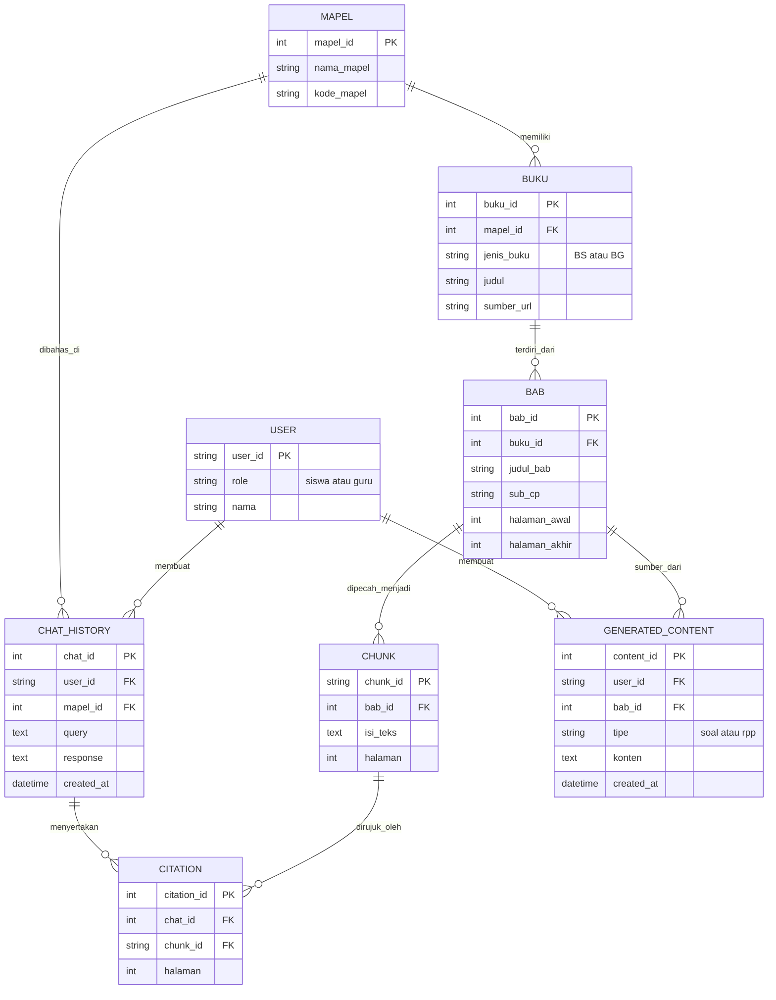

# EduRAG Merdeka — Product Requirements Document (PRD) v2.0
**Next-Generation RAG Learning & Teaching Ecosystem for Kurikulum Merdeka Kelas 10**

---

## 1. Executive Summary & Visi Produk

**EduRAG Merdeka** adalah platform Retrieval-Augmented Generation (RAG) cerdas yang dirancang untuk mentransformasi materi resmi **Buku Siswa (BS)**, **Buku Guru (BG)**, dan **Perangkat Ajar Guru (PAG)** Kurikulum Merdeka Kelas 10 menjadi:
1. **Mode Siswa**: Asisten belajar interaktif berbasis tanya-jawab kontekstual dengan verifikasi sitasi langsung ke bab & halaman buku asli, tahan halusinasi.
2. **Mode Guru**: Generator otomatis untuk paket soal latihan (5 Pilihan Ganda + 2 Esai berstandar HOTS) dan draf RPP/Modul Ajar Deep Learning yang selaras dengan Capaian Pembelajaran (CP) dan Alur Tujuan Pembelajaran (ATP).

Platform ini memanfaatkan kumpulan repositori dan dataset yang telah disiapkan di workspace, mencakup PDF parsing berpresisi tinggi (`Docling`), model embedding & reranking dwibahasa (`BGE-M3` & `BGE-Reranker-v2-M3`), basis data relasional & vektor (`MySQL/SQLite` + `Qdrant`), serta benchmark evaluasi anti-halusinasi (`Ragas`, `IDK-MRC`, `IndoMMLU`).

---

## 2. Pemetaan Sumber Daya & Data Workspace

| Komponen Sistem | Aset / Repositori di Workspace | Peran & Pemanfaatan |
| :--- | :--- | :--- |
| **Buku & Kurikulum Asli** | [`data_kurikulum/`](file:///Users/jevin/eduragmerdeka/data_kurikulum) | Buku Siswa, CP, ATP, Modul Ajar Bab 1–6, dan LKPD sebagai materi indeks & *ground truth*. |
| **PDF Layout Extractor** | [docling](file:///Users/jevin/eduragmerdeka/docling) | Mengekstrak teks, hierarki judul/bab, tabel, dan halaman dari PDF buku teks tanpa merusak struktur. |
| **Vector DB & Search** | Qdrant (`qdrant-client`) & [qdrant-rag-eval](file:///Users/jevin/eduragmerdeka/qdrant-rag-eval) | Indeks vektor HNSW koleksi `kurikulum_merdeka_kelas10` dengan filter payload mapel & jenis buku. |
| **Embedding Engine** | [bge-m3](file:///Users/jevin/eduragmerdeka/bge-m3) / [Indonesian-bge-m3](file:///Users/jevin/eduragmerdeka/Indonesian-bge-m3) / Google Gemini Embeddings | Menghasilkan representasi vektor padat berkualitas tinggi untuk materi pelajaran Bahasa Indonesia & eksakta. |
| **Reranker Engine** | [bge-reranker-v2-m3](file:///Users/jevin/eduragmerdeka/bge-reranker-v2-m3) | Mengurutkan ulang chunk kandidat teratas untuk membuang distorsi konteks sebelum masuk ke LLM. |
| **LLM Inference** | Google Gemini (1.5/2.5 Flash) & [llama3-8b-cpt-sahabatai-v1-instruct](file:///Users/jevin/eduragmerdeka/llama3-8b-cpt-sahabatai-v1-instruct) | Menjawab pertanyaan siswa, memformulasikan soal ujian, dan menyusun RPP. |
| **Anti-Hallucination & Benchmarking** | [IDK-MRC](file:///Users/jevin/eduragmerdeka/IDK-MRC), [IndoMMLU](file:///Users/jevin/eduragmerdeka/IndoMMLU), [ragas](file:///Users/jevin/eduragmerdeka/ragas) | Menguji akurasi sitasi, kepatuhan batas similarity (> 0.7), dan respons penolakan soal di luar modul. |
| **Generator Referensi Soal & RPP** | [Question-Generation](file:///Users/jevin/eduragmerdeka/Question-Generation), [llm-math-education](file:///Users/jevin/eduragmerdeka/llm-math-education), [openbookqa](file:///Users/jevin/eduragmerdeka/openbookqa) | Template dan pola perumusan soal HOTS serta rubrik asesmen. |

---

## 3. Ruang Lingkup (Scope)

### 3.1 In-Scope (Fokus Hackathon & MVP)
1. **Mata Pelajaran Utama (Kelas 10 Fase E)**:
   * Matematika (Eksponen, Logaritma, Vektor, Statistika)
   * IPA Terpadu (Pengukuran, Perubahan Iklim & Lingkungan, Energi Terbarukan)
   * Bahasa Indonesia (Teks Laporan Hasil Observasi, Teks Negosiasi, Anekdot)
   * Bahasa Inggris (tersedia bahan ajar autentik dari `data_kurikulum`)
2. **Mode Siswa**:
   * Chat Q&A berbasis RAG dengan *guardrail* ketat.
   * Setiap jawaban wajib menampilkan sitasi transparan: nama mapel, judul bab, dan nomor halaman.
   * Proteksi halusinasi: Pertanyaan di luar buku dijawab dengan pesan ramah standar tanpa spekulasi AI.
3. **Mode Guru**:
   * **Generator Soal**: Menghasilkan 5 Pilihan Ganda (opsi A–D + kunci + pembahasan) dan 2 Soal Esai berbasis bab spesifik.
   * **Generator RPP/Modul Ajar**: Menghasilkan draf Modul Ajar baku 3 komponen (Tujuan Pembelajaran, Langkah Kegiatan Pembelajaran, Rencana Asesmen).
   * **Caching & Reuse**: Mendeteksi bab yang sudah pernah di-generate untuk efisiensi kuota API.
   * **Ekspor Dokumen**: Unduh hasil dalam format Markdown, Word (`.docx`), atau salin instan.
4. **Role Selector & Riwayat**:
   * Switcher mode tanpa login rumit (Mode Siswa vs Mode Guru).
   * Riwayat percakapan per user dan riwayat konten yang digenerate.

### 3.2 Out-of-Scope (Fase Selanjutnya)
* Integrasi OAuth SSO sekolah / NISN.
* Sinkronisasi nilai otomatis ke Dapodik / LMS Google Classroom.

---

## 4. User Stories

| Peran | Tindakan (Saya Ingin) | Dampak Positif (Agar) |
| :--- | :--- | :--- |
| **Siswa** | Menanyakan penjelasan konsep matematika/IPA/bahasa dengan bahasa natural. | Cepat memahami materi tanpa membaca ratusan halaman PDF secara manual. |
| **Siswa** | Melihat sitasi bab dan nomor halaman di bawah jawaban AI. | Dapat membuka dan memverifikasi langsung ke buku cetak asli sekolah. |
| **Siswa** | Diberitahu secara jujur jika suatu topik tidak terdapat pada buku. | Terhindar dari miskonsepsi akibat halusinasi generatif model AI. |
| **Guru** | Memilih satu bab dan mengklik "Generate Paket Soal". | Memperoleh draf soal ulangan harian (5 PG + 2 Esai) lengkap dengan pembahasan dalam hitungan detik. |
| **Guru** | Memilih Capaian Pembelajaran (CP) dan membuat draf Modul Ajar. | Menghemat jam kerja administratif pembuatan RPP kurikulum merdeka. |
| **Guru** | Menggunakan kembali paket soal atau RPP yang sudah pernah dibuat. | Efisien dan tidak memboroskan kuota API LLM. |

---

## 5. Functional & Non-Functional Requirements

### 5.1 Functional Requirements
1. **Pipeline Ingestion & Chunking**:
   * Sistem membaca PDF buku menggunakan modul parser cerdas (`Docling` / `PyMuPDF`).
   * Teks dipecah menjadi chunk berukuran 500–800 token dengan overlap 100 token, berorientasi sub-bab.
   * Metadata setiap chunk menyimpan: `mapel`, `jenis_buku` (BS/BG), `bab_id`, `bab`, `sub_cp`, `halaman`, `isi_teks`.
2. **Retrieval & Reranking Berbasis Skor**:
   * Query dienkode dengan embedding dense.
   * Pencarian top-k (3–5 chunk) dari Qdrant dengan filter payload `mapel`.
   * Cross-encoder reranker memverifikasi skor kemiripan semantik.
   * **Hard Threshold**: Cosine similarity > 0.70.
3. **Guardrail Anti-Halusinasi**:
   * Jika tidak ada chunk yang melewati ambang batas 0.70, sistem **langsung merespons**:
     > *"Materi tidak ditemukan di buku, coba kata kunci lain."*
     Sistem dilarang memanggil LLM untuk berimprovisasi.
4. **Generator Soal Terstruktur**:
   * Output LLM wajib divalidasi ke skema JSON baku:
     ```json
     {
       "bab": "Eksponen dan Logaritma",
       "soal_pg": [
         {
           "nomor": 1,
           "pertanyaan": "...",
           "opsi": {"A": "...", "B": "...", "C": "...", "D": "..."},
           "jawaban_benar": "B",
           "pembahasan": "...",
           "sitasi_halaman": 14
         }
       ],
       "soal_esai": [
         {
           "nomor": 1,
           "pertanyaan": "...",
           "rubrik_jawaban": "...",
           "sitasi_halaman": 18
         }
       ]
     }
     ```
5. **Generator Modul Ajar (RPP)**:
   * Mengikuti format baku Kemendikbudristek:
     1. Informasi Umum & Identitas Modul
     2. Capaian Pembelajaran & Tujuan Pembelajaran (TP)
     3. Rincian Kegiatan (Pendahuluan, Inti - Deep Learning/Inkuiri, Penutup)
     4. Rencana Asesmen (Diagnostik, Formatif, Sumatif)
6. **Manajemen Riwayat & Sitasi**:
   * Jawaban siswa mencatat relasi di tabel `chat_history` dan `citation`.
   * Soal & RPP tersimpan di tabel `generated_content`.

### 5.2 Non-Functional Requirements
* **Akurasi Fakta**: Zero-hallucination pada materi faktual; sitasi halaman 100% presisi mengacu pada teks buku.
* **Latency**:
  * Chat Siswa: Respons awal < 3 detik.
  * Generator Soal / RPP: Selesai < 15 detik.
* **Efisiensi Biaya**: Mekanisme cache/lookup pada tabel relasional sebelum mengeksekusi request LLM berulang.

---

## 6. Entity Relationship Diagram & Skema Data

### 6.1 ERD Relasional (MySQL Aiven / SQLite Compatible)


---

## 7. Design System & Spesifikasi Antarmuka

### 7.1 Palet Warna Resmi
| Peran Token | Nama Warna | Hex Code | Penggunaan UI |
| :--- | :--- | :--- | :--- |
| **Primary (Dominan)** | Pastel Green | `#7FAE83` | Header kartu, tab mapel aktif, aksen utama (60–70% area visual). |
| **Primary Dark** | Deep Green | `#4F7A56` | Teks judul, border terfokus, ikon aktif. |
| **Secondary** | Pastel Yellow | `#F2C94C` | Tombol CTA "Generate", highlight badge peringatan/opsi baru. |
| **Accent** | Pastel Blue | `#6FB8DE` | Header kartu RPP, link sumber sitasi, tombol ekspor. |
| **Dark Surface** | Deep Green Dark | `#24382F` | Top navigation bar / mode banner gelap. |
| **Background** | White / Light Tint | `#FFFFFF` / `#F4F8F1` | Background aplikasi & latar bubble percakapan. |
| **Text Body** | Slate Dark | `#233229` | Teks bacaan utama, soal, dan rincian modul. |
| **Text Muted** | Slate Gray | `#6E7C72` | Sitasi halaman, metadata tanggal, keterangan bantuan. |

### 7.2 Tipografi
* **Heading (Judul Modul / Kartu)**: `Cambria, Georgia, serif`, Bold, 20–28pt.
* **Body Text**: `Calibri, -apple-system, sans-serif`, Regular, 13–15pt.
* **Caption & Citation Badges**: `Calibri, sans-serif`, Medium, 10–12pt (warna `#6E7C72`).

### 7.3 Komponen UI Spesifik
1. **Header Role Switcher**:
   * Bentuk pill toggle di bar navigasi: `[ 👨‍🎓 Mode Siswa | 👩‍🏫 Mode Guru ]`.
   * Mengubah konteks antarmuka secara instan tanpa reload browser.
2. **Subject Selector Tabs**:
   * Horizontal pills: `[ 📐 Matematika ] [ 🔬 IPA Terpadu ] [ 📖 Bahasa Indonesia ] [ 🇬🇧 Bahasa Inggris ]`.
   * Tab aktif berwarna `#7FAE83` dengan teks putih tebal.
3. **Chat Bubble dengan Citation Badge**:
   * Bubble jawaban AI memiliki background `#FFFFFF` berbayang lembut (`box-shadow: 0 2px 8px rgba(0,0,0,0.06)`).
   * Di bagian bawah teks jawaban tersemat badge kecil berwarna `#6FB8DE` (pastel blue tint):
     `🏷️ Bab 2: Eksponen & Logaritma • Halaman 45`
4. **Generator Card Guru**:
   * Kartu Soal berheader `#7FAE83`, Kartu RPP berheader `#6FB8DE`.
   * Tombol CTA "⚡ Generate Soal / RPP" dengan aksen `#F2C94C` (Pastel Yellow) yang kontras dan menarik.
5. **No-Answer State (Anti-Hallucination)**:
   * Menampilkan ilustrasi buku tertutup ramah dan teks santai:
     > *"Materi tidak ditemukan di buku, coba kata kunci lain."*

---

## 8. Metrik Keberhasilan & Rencana Pengujian

1. **Relevansi & Sitasi (Target: ≥ 8 dari 10 pertanyaan uji)**:
   * Menguji 10 pertanyaan acak berbasis materi kelas 10 (contoh: "Bagaimana cara menyederhanakan bentuk akar?", "Apa struktur teks laporan hasil observasi?").
   * Jawaban wajib akurat dan sitasi mengarah ke nomor halaman yang tepat pada PDF buku.
2. **Uji Jebakan Halusinasi (Target: 100% Lulus)**:
   * Diberikan 5 pertanyaan di luar cakupan kurikulum (contoh: kalkulus multivariabel kuliah, berita selebriti terkini, resep masakan).
   * Sistem harus menghentikan retrieval dan menjawab *"Materi tidak ditemukan di buku"* tanpa memanggil LLM.
3. **Integritas Struktur Generator Guru**:
   * 100% soal yang di-generate lolos parsing JSON dengan 5 PG dan 2 Esai.
   * Draf RPP memuat 3 komponen inti (Tujuan, Kegiatan, Asesmen).
